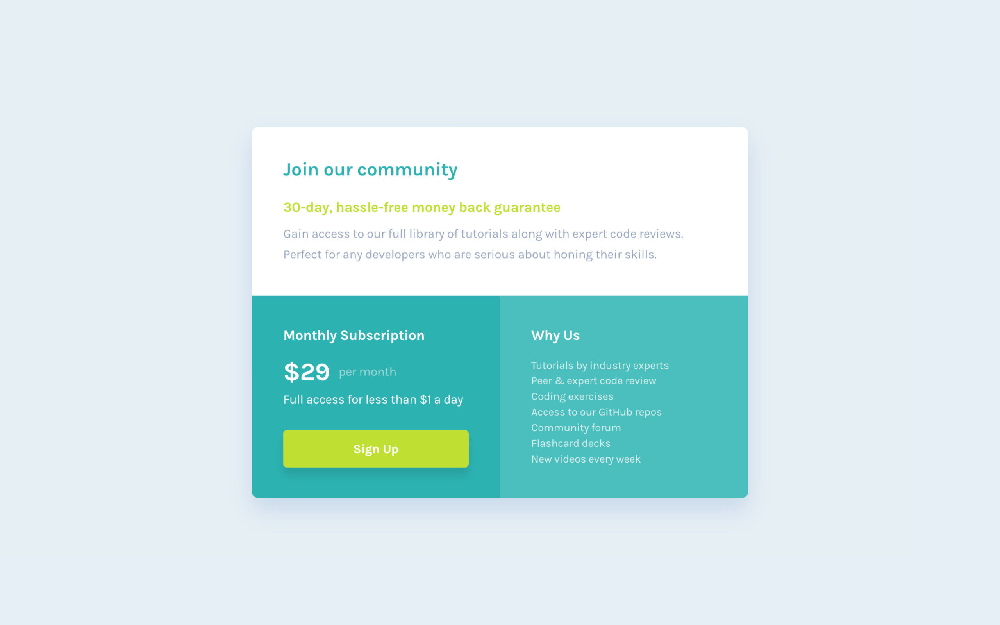

# Frontend Mentor - Single price grid component solution

This is a solution to the [Single price grid component challenge on Frontend Mentor](https://www.frontendmentor.io/challenges/single-price-grid-component-5ce41129d0ff452fec5abbbc).

## Table of contents

- [Overview](#overview)
  - [The challenge](#the-challenge)
  - [Screenshots](#screenshots)
- [Built with](#built-with)
- [Key Features](#key-features)
- [Links](#links)

## Overview

### The challenge

Users should be able to:

- ✅ View the optimal layout for the component depending on their device's screen size
- ✅ See a hover state on desktop for the Sign Up call-to-action

### Screenshots

| Mobile Preview                | Tablet Preview                | Desktop Preview                |
| ----------------------------- | ----------------------------- | ------------------------------ |
|  |  |  |

## Built with

## Key Features

- 📱 Semantic HTML5 markup
- 🎨 Mobile-first responsive design using Tailwind CSS
- 🔍 Proper SEO setup with metadata

## Links

- Solution URL: [Frontend Mentor ↗](https://www.frontendmentor.io/solutions/single-price-grid-component-kJDXE114Hq)
- Live Site URL: [Open on Vercel ↗](https://single-price-grid-component-inky-sigma.vercel.app)
